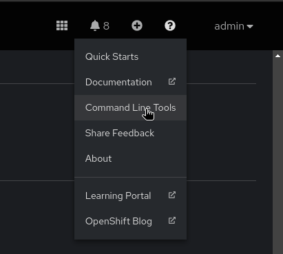
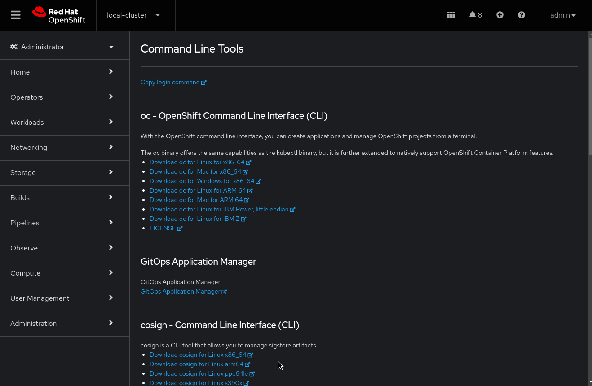

# helm-playground

For playing (aka working) with cosign and helm, you need to install both on your system.

The easiest way to get them is from your OpenShift cluster. The link to the latest helm cli is provided in any OpenShift Cluster; the cosign (and gitsign, ec, rekor-cli) binaries are added to the menu after installing the Trusted Artifact Signer Operator:

  

### Cosign initialization

After saving cosign (and helm) to your path and making it executable, if necessary you should initialize it to work with your sigstore/Trusted Artifact Signer infrastructure, such as rekor (transparency log), fulcio (the CA that issues ephemeral keys, if "keyless" signing is used) and the OIDC provider that fulcio will ask before issuing keys.

[Initializing Cosign](./doc/cosign-init/init.md)

# Signing and verifying a helm chart

## Overview
There are several options how to sign and verify a helm chart:

### Standard Helm Method

The [standard helm method](./doc/standard-helm/sign-helmchart.md) follows the helm guidance for signing a chart. 
It signs a chart with a pre-existing private key and generates a "provenance" file that is used for verification of the signature, as it needs to be stored / distributed alongside the chart.

In theory, the provenance file could be altered alongside the helm chart, so while this serves as a foundation, it is only the bare minimum.

### Standard Helm Method, with added Transparency

To add another layer of security, the signed helm chart can be appended to a tamper-proof ledger, the rekor transparency log, with the help of the helm-sigstore plugin. 
While the signature (and provenance file) remain the same, the signature, file's sha fingerprint and other metadata are stored in the rekor transparency log and are used for verification - this way, you can make sure that the signed helm chart you are verifying is exactly the same as the one that was generated and logged in rekor.

### Sigstore / Trusted Artifact Signer

Trusted Aratifact Signer can sign and verify any blob, including a packaged helm chart.

This method, while not helm-specific adds flexibility in many ways:

- Signing can be done with long-lived keys or tied to an OIDC identity in a "keyless" fashion

- If long-lived keys are preferred, these can be stored in an external key-management system, including k8s/OpenShift, as a secret.

- when the signing process happens (regardless of key type), evidence is stored in the rekor transparency log. Since this is tamper-proof, it is used for verification later.

    - alternatively, for example when the chart needs to be distributed externally, a bundle file can be generated. This can be used for offline verification (similar to the helm provenance file)

## Reference

[Helm Docs "Helm Provenance"](https://helm.sh/docs/topics/provenance/)  

[Helm Sigstore Plugin usage](https://github.com/sigstore/helm-sigstore/blob/main/USAGE.md) 