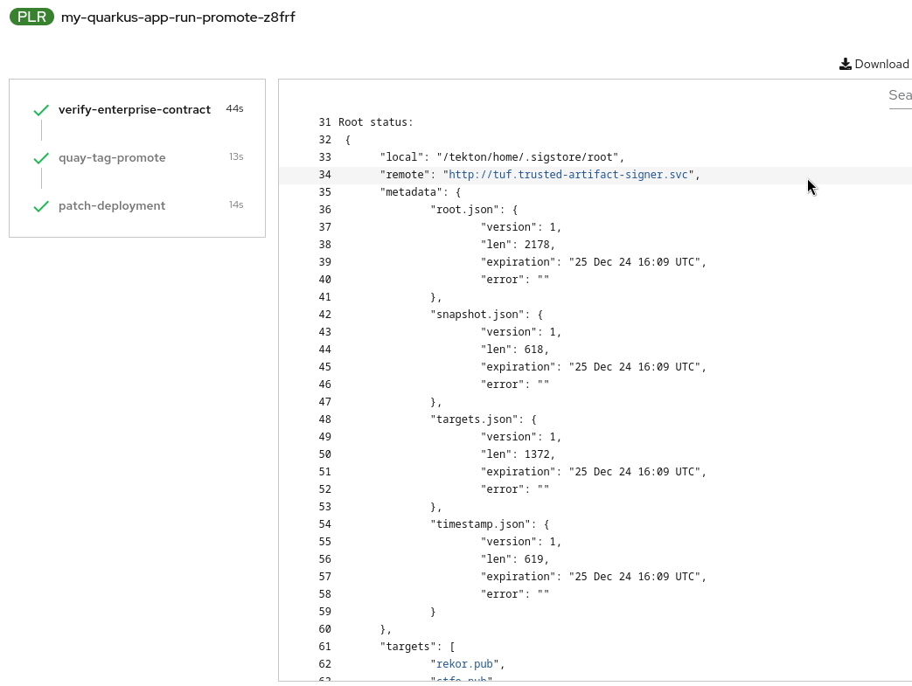

# Initializing Cosign

While some functionality is available with the `cosign` cli, you need to initialize it to interact with the Trusted Artifact Signer infrastructure in your cluster. 

This will alow it to e.g. save signing event (meta-)data in the rekor transparency log, etc.

The [Red Hat documentation](https://docs.redhat.com/en/documentation/red_hat_trusted_artifact_signer/1/html/deployment_guide/verify_the_trusted_artifact_signer_service_installation#signing-and-verifying-containers-by-using-cosign-from-the-command-line-interface_deploy) provides a short script, storing the endpoints in environment variables (as opposed to passing everything in as a long list of parameters):

*__Note__* You need to logged in to your OpenShift Cluster. Also, if you modified the namespace where you installed Trusted Artifact Signer (or you have several installations in different namespaces), you need to modify the namespace parameter `-n trusted-artifact-signer` below:

```
export TUF_URL=$(oc get tuf -o jsonpath='{.items[0].status.url}' -n trusted-artifact-signer)
export OIDC_ISSUER_URL=https://$(oc get route keycloak -n keycloak-system | tail -n 1 | awk '{print $2}')/auth/realms/trusted-artifact-signer
export COSIGN_FULCIO_URL=$(oc get fulcio -o jsonpath='{.items[0].status.url}' -n trusted-artifact-signer)
export COSIGN_REKOR_URL=$(oc get rekor -o jsonpath='{.items[0].status.url}' -n trusted-artifact-signer)
export COSIGN_MIRROR=$TUF_URL
export COSIGN_ROOT=$TUF_URL/root.json
export COSIGN_OIDC_CLIENT_ID="trusted-artifact-signer"
export COSIGN_OIDC_ISSUER=$OIDC_ISSUER_URL
export COSIGN_CERTIFICATE_OIDC_ISSUER=$OIDC_ISSUER_URL
export COSIGN_YES="true"
export SIGSTORE_FULCIO_URL=$COSIGN_FULCIO_URL
export SIGSTORE_OIDC_ISSUER=$COSIGN_OIDC_ISSUER
export SIGSTORE_REKOR_URL=$COSIGN_REKOR_URL
export REKOR_REKOR_SERVER=$COSIGN_REKOR_URL
```

To quickly verify if the environment variables have been successfully set, you can check and should see a similar result:

```
$env | grep URL

TUF_URL=https://tuf-trusted-artifact-signer.apps.cluster-v6v8c.sandbox617.opentlc.com
OIDC_ISSUER_URL=https://keycloak-keycloak-system.apps.cluster-v6v8c.sandbox617.opentlc.com/auth/realms/trusted-artifact-signer
COSIGN_FULCIO_URL=https://fulcio-server-trusted-artifact-signer.apps.cluster-v6v8c.sandbox617.opentlc.com
SIGSTORE_REKOR_URL=https://rekor-server-trusted-artifact-signer.apps.cluster-v6v8c.sandbox617.opentlc.com
SIGSTORE_FULCIO_URL=https://fulcio-server-trusted-artifact-signer.apps.cluster-v6v8c.sandbox617.opentlc.com
COSIGN_REKOR_URL=https://rekor-server-trusted-artifact-signer.apps.cluster-v6v8c.sandbox617.opentlc.com


```

Then you can simply issue 

```
$ cosign initialize 
```
and you should get a similar output, signifying that your local cosign has received and stored the root certificates it needs from the remote Trsuted Artifact Signer instance 

```
Root status: 
 {
	"local": "/home/mnagel/.sigstore/root",
	"remote": "https://tuf-trusted-artifact-signer.apps.cluster-v6v8c.sandbox617.opentlc.com",
	"metadata": {
		"root.json": {
			"version": 1,
			"len": 2178,
			"expiration": "25 Dec 24 16:09 UTC",
			"error": ""
		},
		"snapshot.json": {
			"version": 1,
			"len": 618,
			"expiration": "25 Dec 24 16:09 UTC",
			"error": ""
		},
		"targets.json": {
			"version": 1,
			"len": 1372,
			"expiration": "25 Dec 24 16:09 UTC",
			"error": ""
		},
		"timestamp.json": {
			"version": 1,
			"len": 619,
			"expiration": "25 Dec 24 16:09 UTC",
			"error": ""
		}
	},
	"targets": [
		"ctfe.pub",
		"fulcio_v1.crt.pem",
		"rekor.pub"
	]
}

```

The other environment variables are used depending on the `cosign` command you are using.
You are ready to go.

*__Note__* You also need to initialize cosign if you are using it in a pipeline. However, in that case you could use the cluster-internal addresses for simplification, if your pipeline task is being execuited on OpenShift. If you run your pipeline externally, you need to access the endpoints via their respective URLs, as shown above.

Example log from a Tekton Pipeline Run:



Excerpt from that Tekton Task (here, only the TUF_URL is needed and passed in via command line parameter):

```
    - name: initialize-tuf
      image: quay.io/enterprise-contract/ec-cli:362c6d6824695987bcdb7936c2efa35fd8ffb0e0
      script: |-
        set -euo pipefail

        if [[ -z "${TUF_MIRROR:-}" ]]; then
            echo 'TUF_MIRROR not set. Skipping TUF root initialization.'
            exit
        fi

        echo 'Initializing TUF root...'
        cosign initialize --mirror "${TUF_MIRROR}" --root "${TUF_MIRROR}/root.json"
        echo 'Done!'
      env:
        - name: TUF_MIRROR
          value: "$(params.TUF_MIRROR)"
```

(in the [TAP demo environment](https://demo.redhat.com/catalog?item=babylon-catalog-prod/enterprise.redhat-tap-demo.prod&utm_source=webapp&utm_medium=share-link), these pipelines are stored in Gitlab as part of the templates, e.g here: )

https://gitlab-gitlab.apps.cluster-v6v8c.sandbox617.opentlc.com/rhdh/trusted-application-pipeline-templates/-/blob/main/scaffolder-templates/quarkus-stssc-template/manifests/helm/build/templates/task-verify-enterprise-contract.yaml 

If you are using a fresh installation of RHTAP (Red Hat Trusted Application Pipeline) they are [here](https://github.com/redhat-appstudio/tssc-sample-pipelines/blob/main/pac/tasks/verify-enterprise-contract.yaml) and since TAP uses PAC (Pipelines as Code), the documentation for modifying pipelines (and templates) should be followed: 

https://docs.redhat.com/en/documentation/red_hat_trusted_application_pipeline/1.0/html-single/customizing_red_hat_trusted_application_pipeline/index