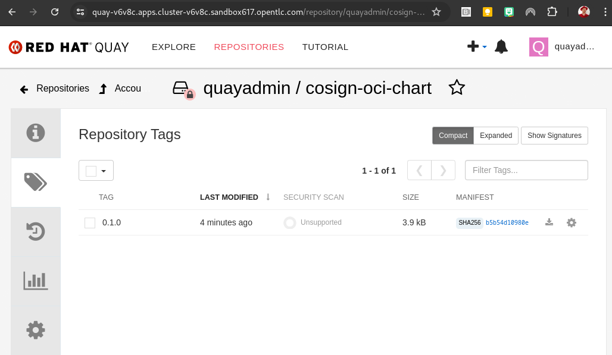
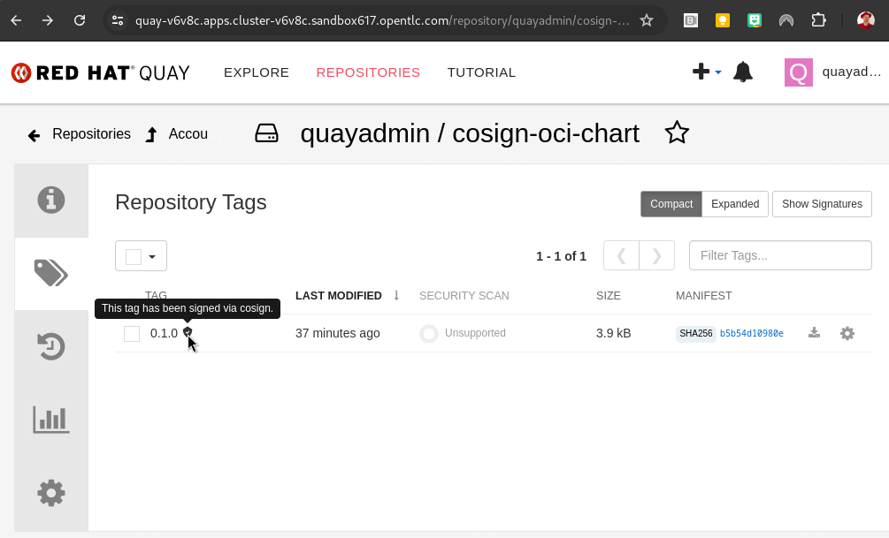
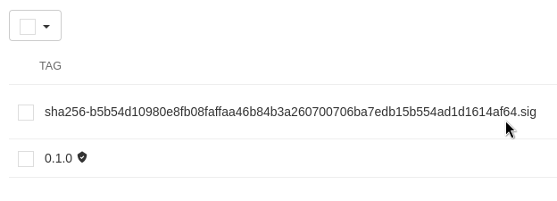

# Keyless signing and verification of a helm chart in an OCI registry

Now that we have [logged in](cosign-sign-helm-oci.md) to our OCI registry, we'll first create a new chart, package it and push it to the registry.

## Pushing and Signing


```
$ helm create cosign-oci-chart
Creating cosign-oci-chart

$ helm package cosign-oci-chart/
Successfully packaged chart and saved it to: /home/mnagel/Documents/appServices/TSSC/computacenter/cosign-oci-chart-0.1.0.tgz
```

### Pushing (and Pulling)

```
$ helm push cosign-oci-chart-0.1.0.tgz oci://quay-v6v8c.apps.cluster-v6v8c.sandbox617.opentlc.com/quayadmin
Pushed: quay-v6v8c.apps.cluster-v6v8c.sandbox617.opentlc.com/quayadmin/cosign-oci-chart:0.1.0
Digest: sha256:b5b54d10980e8fb08faffaa46b84b3a260700706ba7edb15b554ad1d1614af64

```

We now have the chart in our registry 




and can access it e.g. via 

```
helm pull oci://quay-v6v8c.apps.cluster-v6v8c.sandbox617.opentlc.com/quayadmin/cosign-oci-chart --version 0.1.0
Pulled: quay-v6v8c.apps.cluster-v6v8c.sandbox617.opentlc.com/quayadmin/cosign-oci-chart:0.1.0
Digest: sha256:b5b54d10980e8fb08faffaa46b84b3a260700706ba7edb15b554ad1d1614af64


```
- helm pull
- helm show
- helm template
- helm install
- helm upgrade

are some commands available with OCI integration.

### Signing with cosign

We can sign it in the registry via

```
cosign sign quay-v6v8c.apps.cluster-v6v8c.sandbox617.opentlc.com/quayadmin/cosign-oci-chart:0.1.0
```
however, it is recommended to sign an artifact in a registry by its sha256 fingerprint, because tags can change.

```
cosign sign quay-v6v8c.apps.cluster-v6v8c.sandbox617.opentlc.com/quayadmin/cosign-oci-chart@sha256:b5b54d10980e8fb08faffaa46b84b3a260700706ba7edb15b554ad1d1614af64

```

This will then take you through the OIDC workflow (logging in to your OIDC provider) will push the signature directly to the registry.

```

$ cosign sign quay-v6v8c.apps.cluster-v6v8c.sandbox617.opentlc.com/quayadmin/cosign-oci-chart@sha256:b5b54d10980e8fb08faffaa46b84b3a260700706ba7edb15b554ad1d1614af64 
Generating ephemeral keys...
Retrieving signed certificate...

	The sigstore service, hosted by sigstore a Series of LF Projects, LLC, is provided pursuant to the Hosted Project Tools Terms of Use, available at https://lfprojects.org/policies/hosted-project-tools-terms-of-use/.
	Note that if your submission includes personal data associated with this signed artifact, it will be part of an immutable record.
	This may include the email address associated with the account with which you authenticate your contractual Agreement.
	This information will be used for signing this artifact and will be stored in public transparency logs and cannot be removed later, and is subject to the Immutable Record notice at https://lfprojects.org/policies/hosted-project-tools-immutable-records/.

By typing 'y', you attest that (1) you are not submitting the personal data of any other person; and (2) you understand and agree to the statement and the Agreement terms at the URLs listed above.
Your browser will now be opened to:
https://keycloak-keycloak-system.apps.cluster-v6v8c.sandbox617.opentlc.com/auth/realms/trusted-artifact-signer/protocol/openid-connect/auth?access_type=online&client_id=trusted-artifact-signer&code_challenge=QHJr8MYrpiU9nXxsxglt_7GHBsJE0aSZTKdPqGhAP48&code_challenge_method=S256&nonce=2iZLPynJCbww10B41to4Y0CbjsO&redirect_uri=http%3A%2F%2Flocalhost%3A36395%2Fauth%2Fcallback&response_type=code&scope=openid+email&state=2iZLPyUH9wkyh4s84E7A8vOV0Ck
Successfully verified SCT...
tlog entry created with index: 95
Pushing signature to: quay-v6v8c.apps.cluster-v6v8c.sandbox617.opentlc.com/quayadmin/cosign-oci-chart

```

In Quay, we can now see that the chart has been signed


and if we un-hide the signatures, we can see the signature attached.  



### Verifying with cosign

The validation process is very easy, as the signature is now attached to the artifact and we don't need to provide it:

We can verify both the tag and the fingerprint - if the tag changes (now belongs to a different fingerprint) the verification will however fail.

```
$ cosign verify quay-v6v8c.apps.cluster-v6v8c.sandbox617.opentlc.com/quayadmin/cosign-oci-chart:0.1.0 --certificate-identity=user1@opentlc.com | jq

Verification for quay-v6v8c.apps.cluster-v6v8c.sandbox617.opentlc.com/quayadmin/cosign-oci-chart:0.1.0 --
The following checks were performed on each of these signatures:
  - The cosign claims were validated
  - Existence of the claims in the transparency log was verified offline
  - The code-signing certificate was verified using trusted certificate authority certificates
[
  {
    "critical": {
      "identity": {
        "docker-reference": "quay-v6v8c.apps.cluster-v6v8c.sandbox617.opentlc.com/quayadmin/cosign-oci-chart"
      },
      "image": {
        "docker-manifest-digest": "sha256:b5b54d10980e8fb08faffaa46b84b3a260700706ba7edb15b554ad1d1614af64"
      },
      "type": "cosign container image signature"
    },
    "optional": {
      "1.3.6.1.4.1.57264.1.1": "https://keycloak-keycloak-system.apps.cluster-v6v8c.sandbox617.opentlc.com/auth/realms/trusted-artifact-signer",
      "Bundle": {
        "SignedEntryTimestamp": "MGUCMGKARrinv2V+/e4Ra03poGn3MH6Dfws4JQ15yQlFYnGUJIpJuOMHv+39c5G3ylxmUwIxAObPeeEatNzeG2povGP5j+ALhuZEtWanP5OCsWSRhf+C2MWKF0jViwI7Rgti/fnNmw==",
        "Payload": {
          "body": "eyJhcG...n19fX0=",
          "integratedTime": 1719693142,
          "logIndex": 95,
          "logID": "bd3a7a08de404b5665861ccdf7132a04f4a08db666872890944a1a4dcf1227e5"
        }
      },
      "Issuer": "https://keycloak-keycloak-system.apps.cluster-v6v8c.sandbox617.opentlc.com/auth/realms/trusted-artifact-signer",
      "Subject": "user1@opentlc.com"
    }
  }
]

```

Same for the fingerprint:

```
$ cosign verify quay-v6v8c.apps.cluster-v6v8c.sandbox617.opentlc.com/quayadmin/cosign-oci-chart@sha256:b5b54d10980e8fb08faffaa46b84b3a260700706ba7edb15b554ad1d1614af64 --certificate-identity=user1@opentlc.com | jq

Verification for quay-v6v8c.apps.cluster-v6v8c.sandbox617.opentlc.com/quayadmin/cosign-oci-chart@sha256:b5b54d10980e8fb08faffaa46b84b3a260700706ba7edb15b554ad1d1614af64 --
The following checks were performed on each of these signatures:
  - The cosign claims were validated
  - Existence of the claims in the transparency log was verified offline
  - The code-signing certificate was verified using trusted certificate authority certificates
[...

```

