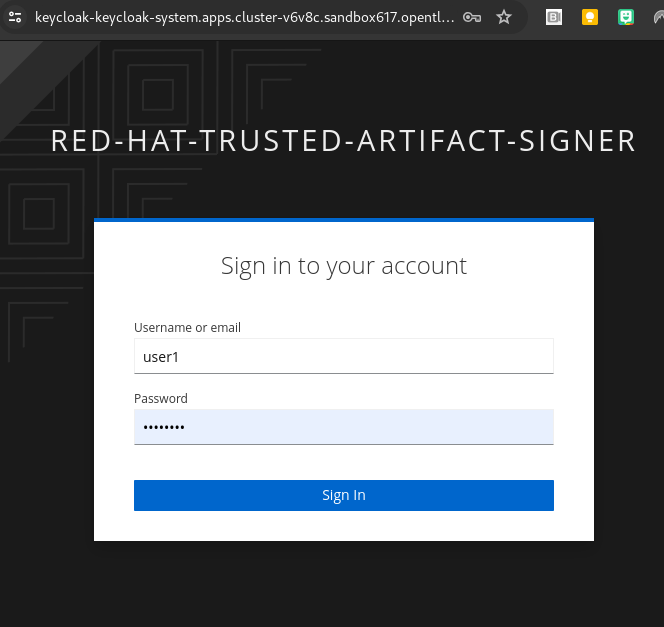
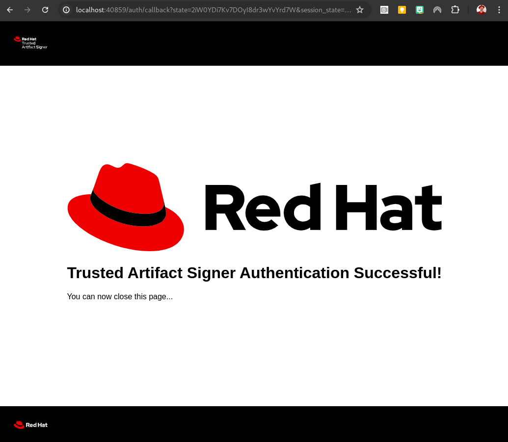

# Keyless signing and verification

The key advantage of "keyless" signing is that there is no need for a centralized key management, including the need for generation, distribution, possible revocation and rotation. 
This simplifies the adopting signing and verification of assets significantly.

## Signing a helm chart

After [initializing cosign](../cosign-init/init.md) to work with the Trusted Artifact Signer infrastructure, let's create a new helm chart and sign it

```
$ helm create cosign-chart
Creating cosign-chart

$ helm package cosign-chart/
Successfully packaged chart and saved it to: /home/mnagel/Documents/appServices/TSSC/computacenter/cosign-chart-0.1.0.tgz
```

To sign this chart (or any other file), invoke cosign using the `sign-blob` command:

```
$ cosign sign-blob cosign-chart-0.1.0.tgz --bundle cosign-chart-0.1.0.tgz.bundle
```

*__Note__*: The bundle file contains the signature that is required to verify the blob against the rekor transparency log. When signing container images (or blobs stored in OCI registries) the signature is automatically attached to artifact in the registry, so no bundle file is needed, unless the image should be verified without access to rekor (offline or shipped to a customer with no access to the transparency log). The bundle file name can be anything, but it is a good practice to name it to match the signed artifact. 


During this process, your OIDC provider will challenge you to authenticate, in this example, the configured Keycloak instance. Once successfully authenticated, the signing process will happen:

  



```
$ cosign sign-blob cosign-chart-0.1.0.tgz --bundle cosign-chart-0.1.0.tgz.bundle
Using payload from: cosign-chart-0.1.0.tgz
Generating ephemeral keys...
Retrieving signed certificate...

	The sigstore service, hosted by sigstore a Series of LF Projects, LLC, is provided pursuant to the Hosted Project Tools Terms of Use, available at https://lfprojects.org/policies/hosted-project-tools-terms-of-use/.
	Note that if your submission includes personal data associated with this signed artifact, it will be part of an immutable record.
	This may include the email address associated with the account with which you authenticate your contractual Agreement.
	This information will be used for signing this artifact and will be stored in public transparency logs and cannot be removed later, and is subject to the Immutable Record notice at https://lfprojects.org/policies/hosted-project-tools-immutable-records/.

By typing 'y', you attest that (1) you are not submitting the personal data of any other person; and (2) you understand and agree to the statement and the Agreement terms at the URLs listed above.
Your browser will now be opened to:
https://keycloak-keycloak-system.apps.cluster-v6v8c.sandbox617.opentlc.com/auth/realms/trusted-artifact-signer/protocol/openid-connect/auth?access_type=online&client_id=trusted-artifact-signer&code_challenge=Mu0IHSQhtmKHFk9xrMsTiXhjVb9if9I__fDhIKpFPNI&code_challenge_method=S256&nonce=2iW6UWu6L4hsZYCIHRczL3WTIyH&redirect_uri=http%3A%2F%2Flocalhost%3A35641%2Fauth%2Fcallback&response_type=code&scope=openid+email&state=2iW6URjO03KflZJQiuwYBQlOa3F
Successfully verified SCT...
using ephemeral certificate:
-----BEGIN CERTIFICATE-----
MIIDZzCCAuygAwIBAgIUdTKk6ycmd2oZizoMhVDsf4AcCigwCgYIKoZIzj0EAwMw
LDEQMA4GA1UEChMHUmVkIEhhdDEYMBYGA1UEAxMPZnVsY2lvLmhvc3RuYW1lMB4X
DTI0MDYyODE3MDAwMloXDTI0MDYyODE3MTAwMlowADBZMBMGByqGSM49AgEGCCqG
SM49AwEHA0IABBxxnEny29JnKbNnijejtIagozktmV1lZFq6Kl+oBzy/nuNAZEp7
/YIwqP7z28n2E15cTZoaTU/uFjpZ5noWp5+jggIWMIICEjAOBgNVHQ8BAf8EBAMC
B4AwEwYDVR0lBAwwCgYIKwYBBQUHAwMwHQYDVR0OBBYEFDAGL/EYW0pAYmF4xRQq
bvoBBWN9MB8GA1UdIwQYMBaAFGvoqY3vFF5/xuxiXBuV8QRbui4oMB8GA1UdEQEB
/wQVMBOBEXVzZXIxQG9wZW50bGMuY29tMHwGCisGAQQBg78wAQEEbmh0dHBzOi8v
a2V5Y2xvYWsta2V5Y2xvYWstc3lzdGVtLmFwcHMuY2x1c3Rlci12NnY4Yy5zYW5k
Ym94NjE3Lm9wZW50bGMuY29tL2F1dGgvcmVhbG1zL3RydXN0ZWQtYXJ0aWZhY3Qt
c2lnbmVyMH4GCisGAQQBg78wAQgEcAxuaHR0cHM6Ly9rZXljbG9hay1rZXljbG9h
ay1zeXN0ZW0uYXBwcy5jbHVzdGVyLXY2djhjLnNhbmRib3g2MTcub3BlbnRsYy5j
b20vYXV0aC9yZWFsbXMvdHJ1c3RlZC1hcnRpZmFjdC1zaWduZXIwgYsGCisGAQQB
1nkCBAIEfQR7AHkAdwDl12b/TAIA+ZHmB+Ic1MMiLPPd9ua8cTnyiqUX4J1jDgAA
AZBfyiexAAAEAwBIMEYCIQCuJ440mrM48zXlJ5tTubLIEi669sojgQpoLWu/GA9P
tQIhAMgERKJiIa0HXN2APs2uNC0f200NTc14mm9ExXR8v7eSMAoGCCqGSM49BAMD
A2kAMGYCMQD2opOg6vdZZT5oT+GDTuI8gkvth6UpI5ym/LhKI5yMv0RsFrCZfjgW
gFH3bIgKjSECMQCB0P7oH3XNMqL9u7WBy0T2A5558pqKqChKW1ZixpIK/eh38sIq
b9Rp2m3+V9eUXiM=
-----END CERTIFICATE-----

tlog entry created with index: 50

Wrote bundle to file cosign-chart-0.1.0.tgz.bundle
MEYCIQDqOSdPq1kpa07p7RQ3aIgkvnKr+h09kgKmLy8ucWsnjQIhAOZK3G7PS7x8bOuc7r1iA87lqldaVJB5z3CiGZAZEV+M

```

## Verifying a helm chart

To verify the chart (blob), cosign needs the `certificate identity`, in other words, "who was the certificate created for", or "who signed it" along with the bundle file.

``` 
$ cosign verify-blob cosign-chart-0.1.0.tgz --certificate-identity=user1@opentlc.com --bundle cosign-chart-0.1.0.tgz.bundle 
Verified OK
```

This can also be provided as a regular expression, in this case matching all identities start start with `user` and end with `@opentlc.com` (it was signed by user1@opentlc.com)


```
$ cosign verify-blob cosign-chart-0.1.0.tgz --certificate-identity-regexp=^user.*@opentlc\.com$ --bundle cosign-chart-0.1.0.tgz.bundle 
Verified OK
```

### Searching the rekor log

Similarly to the [previous example](../standard-helm-rekor/sign-helmchart-rekor.md) you can also search the rekor transparency log for entries matching the signer or the artifact name:

```
$ rekor-cli search --artifact cosign-chart-0.1.0.tgz
Found matching entries (listed by UUID):
5b403967758051d4acfd5a4abcfac197c0a59fd397191fa2c3a4c4d4bccff378599701cefcc12161
5b403967758051d4d7402058c687b05b8b3427e2a2e4d344e7f781de603ae7cd373d1679c4eded37
5b403967758051d4a5d720df5ce4ac5f934566bdd0656bee0acfe21fb8beff7985842d8ab79dfcd3
```

In this case, three signing events of an artifact by the same name have been logged.

Was it also the same file?

```
$ sha256sum cosign-chart-0.1.0.tgz
22a657d71b51931e0ac5c4e1856a7faced93cff375b79253123bb07c99752f6d  cosign-chart-0.1.0.tgz 

$ rekor-cli search --sha 22a657d71b51931e0ac5c4e1856a7faced93cff375b79253123bb07c99752f6d
Found matching entries (listed by UUID):
5b403967758051d4a5d720df5ce4ac5f934566bdd0656bee0acfe21fb8beff7985842d8ab79dfcd3
5b403967758051d4acfd5a4abcfac197c0a59fd397191fa2c3a4c4d4bccff378599701cefcc12161
5b403967758051d4d7402058c687b05b8b3427e2a2e4d344e7f781de603ae7cd373d1679c4eded37

```
Yes, three signatures of the same fingerprint (sha256)


```
$ rekor-cli search --email user1@opentlc.com
Found matching entries (listed by UUID):
5b403967758051d4d7402058c687b05b8b3427e2a2e4d344e7f781de603ae7cd373d1679c4eded37
5b403967758051d4a5d720df5ce4ac5f934566bdd0656bee0acfe21fb8beff7985842d8ab79dfcd3
5b403967758051d4acfd5a4abcfac197c0a59fd397191fa2c3a4c4d4bccff378599701cefcc12161
5b403967758051d495d8ea5ce792498111970728710b9cf26d9ac063f2f8c88bf7da42138f7e913b
5b403967758051d4e45f8d160c843a2ded25a65760094cedb2b5b10238179299a7c65dba0aa01556

```
There have been five signatures by the same user


