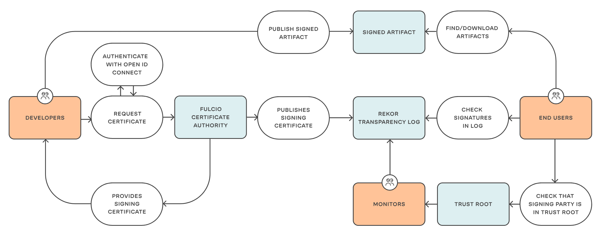

# Signing and verification with cosign

Cosign (in conjunction with the Trusted Artifact Signer / Sigstore infrastructure) can sign and verify container images, but also any blob / artifact.

Here, a packaged (but yet unsigned) helm chart will be signed and verified.

With Trusted Artifact Signer, we have two options:

1) In a ["keyless" fashion](cosign-sign-helm-keyless.md) - the signing party requests a signing certificate from fulcio, which in turn asks the OIDC provider to authenticate the party. Once that is done, the signing process happens and the event (and its metadata) is stored in the rekor transparency log.

2) With [long-lived keys](cosign-sign-helm-keys.md) (that can be local or in a KMS- Key Management System). In this case, an OIDC Authentication doesn't happen, but the signing process is still recorded in rekor.

